# Product Requirements Document — Cloud Cost Optimizer & Remediation Engine

**Project:** Cloud Cost Optimizer & Remediation Engine  
**Focus Area:** FinOps  
**Target Role Signal:** Senior Forward Deployed Engineer  
**MVP Timebox:** 4–6 hours preferred; 16 hours maximum  
**Primary Goal:** Build a Python-based, API-first application that ingests AWS/Azure billing and resource exports, identifies cloud waste, and generates safe remediation commands with human approval.

---

## 1. Executive Summary

Cloud teams often know they are overspending but hesitate to delete resources because the operational risk is high. The **Cloud Cost Optimizer & Remediation Engine** helps FinOps and platform teams find avoidable cloud waste, understand the evidence, estimate savings, and generate safe remediation steps.

The MVP will ingest AWS and Azure billing/resource export files in CSV or JSON format, normalize them into a common resource model, apply deterministic rules to detect orphaned resources and idle compute candidates, and generate a **remediation pack** for each finding. The remediation pack includes pre-check commands, backup/snapshot commands, dry-run commands where available, final CLI commands, SDK/API logic, risk notes, and human approval status.

The product is intentionally **human-in-the-loop**. It does not execute destructive cloud actions in the MVP. It generates evidence-backed recommendations and lets the user approve, reject, or simulate remediation.

---

## 2. Interview Success Strategy

This project should demonstrate more than code. It should show senior FDE judgment:

1. **Client empathy:** FinOps buyers want savings; cloud engineers want safety and proof.
2. **Technical precision:** Billing data alone does not always prove idleness. The product must distinguish high-confidence orphaned resources from lower-confidence idle candidates.
3. **Operational safety:** Never delete resources without pre-checks, backups, approvals, and audit logs.
4. **API-first architecture:** The dashboard should be one consumer of a clean API, not the only interface.
5. **Deterministic logic:** Use rules for detection and command generation. Do not rely on an LLM to invent cloud actions.
6. **Strong demo narrative:** Show upload → scan → savings → evidence → commands → approval → simulation → audit trail.
7. **Production thinking:** Explain how the MVP would become a real enterprise FinOps platform.

---

## 3. Problem Statement

Cloud waste accumulates through unattached disks, idle virtual machines, forgotten test environments, and resources with unclear ownership. Existing cost reports often show spend but do not translate findings into safe, actionable remediation. Engineers still need to manually investigate the resource, confirm it is safe, and craft the correct provider-specific commands.

The system solves this by converting billing/resource export data into actionable, reviewable remediation recommendations.

---

## 4. Target Users And Personas

### 4.1 FinOps Lead

**Needs:** Find savings quickly, prioritize the biggest waste, report monthly/annual impact.  
**Pain:** Cost reports are noisy and not action-oriented.  
**Success:** Can show leadership a credible savings number and remediation plan.

### 4.2 Cloud Platform Engineer

**Needs:** Understand why a resource was flagged and what command would fix it.  
**Pain:** Deleting cloud resources can break production.  
**Success:** Can inspect evidence, run pre-checks, and approve safe actions.

### 4.3 CTO/CFO Stakeholder

**Needs:** Understand financial impact and risk posture.  
**Pain:** Cloud spend grows without clear accountability.  
**Success:** Sees annualized savings and confidence that remediation is controlled.

---

## 5. Goals

### MVP Goals

- Ingest AWS and Azure exports in CSV and JSON.
- Normalize provider-specific fields into a common resource model.
- Store imports, resources, recommendations, remediation commands, and audit events in SQLite.
- Detect high-confidence orphaned storage resources.
- Detect idle VM candidates when utilization metrics exist.
- Mark idle VM candidates as low-confidence or needs-metrics when utilization fields are missing.
- Estimate monthly and annualized savings.
- Generate exact AWS/Azure CLI remediation commands.
- Generate SDK/API remediation pseudocode or logic snippets.
- Provide a dashboard for upload, findings, savings, remediation detail, and audit trail.
- Provide a human approval/simulation workflow.
- Include tests, sample data, README, demo script, and final submission checklist.

### Non-Goals For MVP

- Execute destructive commands against real AWS or Azure accounts.
- Require live cloud credentials.
- Provision paid cloud infrastructure.
- Build full RBAC/SSO.
- Build multi-tenant SaaS billing.
- Guarantee deletion safety without cloud-native state verification.
- Use LLMs as source-of-truth for cloud waste detection.

---

## 6. Product Name

Recommended demo name: **CloudWaste Sentinel**

Alternative names:
- Cloud Cost Sentinel
- FinOps Remediator
- WasteOps Engine

Use one consistent name throughout the app and deck.

---

## 7. Core User Journey

1. User opens dashboard.
2. User uploads an AWS or Azure billing/resource export file.
3. System validates and normalizes the file.
4. User sees resources scanned and import summary.
5. User clicks **Run Recommendations**.
6. System applies deterministic rules.
7. User sees estimated monthly and annual savings.
8. User opens a recommendation.
9. System shows evidence, confidence, risk, and remediation pack.
10. User approves, rejects, or simulates the remediation.
11. System records the action in the audit log.
12. User exports recommendations as CSV or includes them in the final presentation.

---

## 8. Functional Requirements

### FR1 — File Upload And Import

The system must allow a user to upload AWS or Azure data files.

**Supported formats:**
- `.csv`
- `.json`

**Required behavior:**
- Detect provider from file content where possible.
- Allow user/provider override if detection is ambiguous.
- Parse records into a staging representation.
- Validate required fields.
- Store import metadata.
- Store parse errors with row/index numbers.
- Preserve source file name and source row/index for evidence.

**Acceptance criteria:**
- AWS CSV sample imports successfully.
- AWS JSON sample imports successfully.
- Azure CSV sample imports successfully.
- Azure JSON sample imports successfully.
- Bad files return actionable validation errors.

---

### FR2 — Common Resource Normalization

The system must normalize provider-specific fields into a unified model.

**Common normalized fields:**

| Field | Description |
|---|---|
| provider | `aws` or `azure` |
| account_id | AWS account ID or Azure subscription ID |
| resource_id | Cloud resource identifier |
| resource_name | Human-readable name where available |
| resource_type | Disk, VM, volume, instance, etc. |
| service | EC2, EBS, Microsoft.Compute, etc. |
| region | AWS region or Azure location |
| resource_group | Azure resource group, optional for AWS |
| usage_start_date | Start date from billing/export |
| usage_end_date | End date from billing/export |
| monthly_cost | Normalized monthly cost estimate |
| currency | Currency code |
| tags | Key-value tags |
| state | Resource state if available |
| attached_to | Parent attachment target if available |
| disk_state | Disk-specific state |
| managed_by | Azure managed disk attachment field |
| power_state | VM power state |
| cpu_p95 | Optional CPU utilization metric |
| network_in_mb | Optional network metric |
| network_out_mb | Optional network metric |
| source_file | Uploaded file name |
| source_row | Source row/index |

**Acceptance criteria:**
- Provider-specific records are queryable through one `/api/resources` endpoint.
- Every recommendation can cite source fields.

---

### FR3 — Waste Detection Rule Engine

The system must use deterministic rules for MVP waste detection.

#### Rule A — AWS Unattached EBS Volume

A resource is flagged when:
- provider = `aws`
- resource type indicates EBS volume
- state is `available` or `unattached`, or `attached_to` is empty
- monthly cost > 0
- no protected tag is present

**Confidence:** High when state explicitly confirms unattached and no attachment exists.

#### Rule B — Azure Unattached Managed Disk

A resource is flagged when:
- provider = `azure`
- resource type indicates managed disk
- `disk_state = Unattached` or `managed_by` is empty
- monthly cost > 0
- no protected tag is present

**Confidence:** High when both `disk_state` and `managed_by` confirm unattached status.

#### Rule C — AWS Idle EC2 Candidate

A resource is flagged when:
- provider = `aws`
- resource type indicates EC2 instance
- utilization metrics are present
- `cpu_p95 < 5`
- `network_in_mb + network_out_mb < 100`
- monthly cost > 0
- no protected tag is present

**Confidence:** Medium to High if utilization metrics cover a meaningful period. Low or needs-metrics if metrics are absent.

#### Rule D — Azure Idle VM Candidate

A resource is flagged when:
- provider = `azure`
- resource type indicates virtual machine
- utilization metrics are present
- `cpu_p95 < 5`
- `network_in_mb + network_out_mb < 100`
- monthly cost > 0
- no protected tag is present

**Confidence:** Medium to High if metrics exist. Low or needs-metrics if metrics are absent.

#### Rule E — Protected Resource Guardrail

A resource should not receive a destructive recommendation if tags include values such as:

- `keep=true`
- `protected=true`
- `do-not-delete=true`
- `environment=prod`
- `owner=critical`
- `business-critical=true`

Protected resources should be suppressed or marked as `REQUIRE_MANUAL_REVIEW`.

---

## 9. Recommendation Model

Every recommendation must include:

| Field | Description |
|---|---|
| recommendation_id | Unique ID |
| provider | AWS or Azure |
| finding_type | `UNATTACHED_DISK`, `IDLE_VM`, `NEEDS_METRICS`, etc. |
| resource_id | Cloud identifier |
| resource_type | Resource type |
| account_id | Account/subscription |
| region | Region/location |
| estimated_monthly_savings | Monthly savings estimate |
| estimated_annual_savings | Monthly savings x 12 |
| confidence | LOW, MEDIUM, HIGH |
| risk_level | LOW, MEDIUM, HIGH |
| recommended_action | DELETE_DISK, STOP_VM, DEALLOCATE_VM, RIGHTSIZING_REVIEW, MANUAL_REVIEW |
| evidence | Source fields supporting the finding |
| status | DRAFT, REVIEWED, APPROVED, REJECTED, SIMULATED_EXECUTION |
| created_at | Timestamp |
| updated_at | Timestamp |

---

## 10. Remediation Pack Requirements

Each recommendation must generate a remediation pack.

### Remediation Pack Fields

| Field | Description |
|---|---|
| explanation | Plain-English reason the resource was flagged |
| pre_check_command | Safe command to verify the current state |
| backup_command | Snapshot/backup command where applicable |
| dry_run_command | Dry-run command where supported |
| final_command | Final remediation command requiring approval |
| sdk_logic | API/SDK logic or pseudocode |
| risk_warning | What could go wrong |
| rollback_note | How to recover, or honest note if direct rollback is unavailable |
| requires_approval | Boolean |
| execution_mode | `GENERATE_ONLY` or `SIMULATED` |

### Required AWS Command Templates

#### AWS EBS Unattached Volume

Pre-check:

```bash
aws ec2 describe-volumes --volume-ids <volume_id> --region <region>
```

Snapshot:

```bash
aws ec2 create-snapshot --volume-id <volume_id> --region <region> --description "pre-delete snapshot created by Cost Optimizer"
```

Dry run:

```bash
aws ec2 delete-volume --volume-id <volume_id> --region <region> --dry-run
```

Final:

```bash
aws ec2 delete-volume --volume-id <volume_id> --region <region>
```

#### AWS Idle EC2 Instance

Pre-check:

```bash
aws ec2 describe-instances --instance-ids <instance_id> --region <region>
```

Safer action for running idle instance:

```bash
aws ec2 stop-instances --instance-ids <instance_id> --region <region>
```

High-risk final action only after approval:

```bash
aws ec2 terminate-instances --instance-ids <instance_id> --region <region>
```

### Required Azure Command Templates

#### Azure Unattached Managed Disk

Pre-check:

```bash
az disk show --ids <resource_id>
```

Snapshot:

```bash
az snapshot create --resource-group <resource_group> --source <resource_id> --name <generated_snapshot_name>
```

Final:

```bash
az disk delete --ids <resource_id> --yes
```

#### Azure Idle VM

Pre-check:

```bash
az vm get-instance-view --ids <resource_id>
```

Safer action:

```bash
az vm deallocate --ids <resource_id>
```

High-risk final action only after approval:

```bash
az vm delete --ids <resource_id> --yes
```

---

## 11. API Requirements

The application must be API-first. The dashboard must consume or align with the same backend operations exposed by the API.

### Required Endpoints

| Method | Endpoint | Purpose |
|---|---|---|
| GET | `/health` | Health check |
| POST | `/api/imports/upload` | Upload CSV/JSON export |
| GET | `/api/imports` | List imports |
| GET | `/api/resources` | List normalized resources |
| POST | `/api/recommendations/run` | Run detection rules |
| GET | `/api/recommendations` | List recommendations |
| GET | `/api/recommendations/{id}` | Recommendation detail |
| GET | `/api/recommendations/{id}/remediation-pack` | Retrieve commands and remediation logic |
| POST | `/api/recommendations/{id}/approve` | Approve recommendation |
| POST | `/api/recommendations/{id}/reject` | Reject recommendation |
| POST | `/api/recommendations/{id}/simulate` | Simulate command execution without executing cloud command |
| GET | `/api/summary` | Dashboard summary metrics |
| GET | `/api/export/recommendations.csv` | Export recommendations |

### API Acceptance Criteria

- OpenAPI docs are available.
- Endpoints return structured JSON.
- Errors are clear and actionable.
- Simulation never executes real cloud commands.
- Recommendation state transitions are validated.

---

## 12. Dashboard Requirements

The dashboard must support a polished demo.

### Screen 1 — Upload

- Upload AWS/Azure CSV/JSON.
- Show provider detection.
- Show import status.
- Show validation errors.

### Screen 2 — Executive Summary

- Total resources scanned.
- Total waste findings.
- Estimated monthly savings.
- Estimated annual savings.
- Savings by provider.
- Savings by finding type.
- Recommendation status counts.

### Screen 3 — Recommendations Table

Columns:
- Provider
- Resource ID
- Resource type
- Account/subscription
- Region/location
- Finding type
- Monthly savings
- Confidence
- Risk
- Recommended action
- Status
- View details

### Screen 4 — Remediation Detail

Show:
- Explanation.
- Evidence fields.
- Confidence score.
- Risk label.
- Pre-check command.
- Backup/snapshot command.
- Dry-run command.
- Final command.
- SDK/API logic.
- Approve/reject/simulate buttons.

### Screen 5 — Audit Log

Show:
- File imports.
- Rule runs.
- Recommendation approvals.
- Rejections.
- Simulations.
- Export events.

---

## 13. Data Model

### ImportBatch

- id
- filename
- provider_detected
- provider_selected
- file_type
- record_count
- error_count
- created_at

### CloudResource

- id
- import_batch_id
- provider
- account_id
- resource_id
- resource_name
- resource_type
- service
- region
- resource_group
- usage_start_date
- usage_end_date
- monthly_cost
- currency
- tags_json
- state
- attached_to
- disk_state
- managed_by
- power_state
- cpu_p95
- network_in_mb
- network_out_mb
- source_row
- raw_record_json
- created_at

### Recommendation

- id
- resource_id_fk
- finding_type
- estimated_monthly_savings
- estimated_annual_savings
- confidence
- risk_level
- recommended_action
- evidence_json
- status
- created_at
- updated_at

### RemediationPack

- id
- recommendation_id
- explanation
- pre_check_command
- backup_command
- dry_run_command
- final_command
- sdk_logic
- risk_warning
- rollback_note
- requires_approval
- execution_mode
- created_at

### AuditEvent

- id
- entity_type
- entity_id
- action
- actor
- metadata_json
- created_at

---

## 14. Technical Architecture

### Recommended MVP Stack

- **Backend:** FastAPI
- **Database:** SQLite
- **ORM:** SQLAlchemy
- **Validation:** Pydantic
- **Parsing:** Python csv/json libraries or pandas
- **Testing:** pytest
- **Dashboard:** FastAPI templates with HTMX/Jinja or lightweight React/Vite
- **Charts:** Simple chart library or server-rendered summary cards
- **Package management:** uv, pip, or poetry
- **Local execution:** no cloud credentials required

### Logical Components

1. **Upload API** receives CSV/JSON files.
2. **Parser** converts files to records.
3. **Normalizer** maps AWS/Azure fields into common model.
4. **Rule Engine** evaluates resources for waste.
5. **Savings Calculator** estimates monthly/annual savings.
6. **Command Generator** creates remediation packs.
7. **Approval Workflow** manages statuses.
8. **Dashboard** visualizes results.
9. **Audit Logger** records user/system actions.
10. **Eval Harness** validates rules against known fixtures.

### Mermaid Architecture Diagram

```mermaid
flowchart LR
    A[AWS/Azure CSV or JSON Export] --> B[FastAPI Upload Endpoint]
    B --> C[Parser]
    C --> D[Normalizer]
    D --> E[(SQLite DB)]
    E --> F[Rule Engine]
    F --> G[Savings Calculator]
    G --> H[Command Generator]
    H --> I[Remediation Pack]
    I --> J[Dashboard]
    J --> K[Approve / Reject / Simulate]
    K --> L[Audit Log]
```



---

## 15. Sample Data Plan

Create sample files that make the demo easy.

### AWS Sample Records

Include:
- 1 unattached EBS volume with monthly cost.
- 1 attached EBS volume that should not be flagged.
- 1 protected EBS volume with `keep=true` that should not be destructively recommended.
- 1 idle EC2 instance with CPU/network metrics.
- 1 EC2 instance missing metrics that should be `NEEDS_METRICS` or low-confidence.

### Azure Sample Records

Include:
- 1 unattached managed disk.
- 1 attached managed disk that should not be flagged.
- 1 protected disk with `environment=prod`.
- 1 idle VM with CPU/network metrics.
- 1 VM missing metrics.

### Expected Demo Outcome

The sample data should produce:
- At least 4 strong recommendations.
- At least 1 protected-resource warning.
- At least 1 needs-metrics warning.
- Clear estimated monthly/annual savings.
- Both AWS and Azure command examples.

---

## 16. Safety, Security, And Guardrails

### Safety Guardrails

- MVP must not execute real cloud commands.
- Destructive commands must be marked as requiring approval.
- Protected tags suppress or escalate recommendations.
- Idle VM recommendations should prefer stop/deallocate before termination/deletion.
- Disk deletion should recommend snapshot first.
- If deletion has no simple rollback, state that clearly.

### Security Guardrails

- Do not require cloud credentials.
- Do not store secrets.
- Do not print secrets from uploaded files.
- Add `.env.example`, but no real `.env` in repository.
- Add `.gitignore` for environment files and local database files.
- Treat uploaded files as untrusted input.

### FinOps Trust Guardrails

- Every finding must cite evidence.
- Every finding must have confidence and risk.
- Billing-only VM idleness must not be overstated.
- All state-changing actions must be audited.

---

## 17. Testing And Evaluation Requirements

### Unit Tests

- AWS CSV parser.
- AWS JSON parser.
- Azure CSV parser.
- Azure JSON parser.
- AWS EBS unattached rule.
- Azure disk unattached rule.
- AWS idle EC2 rule.
- Azure idle VM rule.
- Protected tag suppression.
- Missing metrics behavior.
- Command generation for AWS and Azure.

### API Tests

- Upload file.
- List resources.
- Run recommendations.
- Fetch recommendation detail.
- Approve recommendation.
- Reject recommendation.
- Simulate recommendation.
- Export CSV.

### Eval Script

Create an eval script that compares expected findings vs actual findings.

Output:
- expected finding count
- actual finding count
- missing findings
- extra findings
- command generation pass/fail
- savings total

---

## 18. Key Metrics

### Product Metrics

- Number of resources scanned.
- Number of recommendations generated.
- Estimated monthly savings.
- Estimated annual savings.
- Savings by provider.
- Recommendations by confidence.
- Recommendations by risk.
- Approved/rejected/simulated counts.

### Engineering Metrics

- Parser success rate.
- Rule test pass rate.
- API test pass rate.
- Eval precision-style score.
- Time to generate recommendation after upload.

---

## 19. MVP Build Plan

### Hour 0–1 — Plan And Scaffold

- Confirm architecture.
- Scaffold FastAPI project.
- Add SQLite models.
- Add sample data structure.
- Add README skeleton.

### Hour 1–2 — Ingestion And Normalization

- Implement CSV/JSON parsing.
- Implement AWS/Azure normalization.
- Persist resources.
- Add parser tests.

### Hour 2–3 — Detection Rules And Commands

- Implement rule engine.
- Implement savings calculator.
- Implement remediation command generator.
- Add unit tests.

### Hour 3–4 — API And Dashboard

- Implement required endpoints.
- Build dashboard views.
- Add recommendation detail and remediation pack view.

### Hour 4–5 — Tests, Eval, Polish

- Add API tests.
- Add eval script.
- Improve sample data.
- Fix bugs.
- Polish dashboard.

### Hour 5–6 — Submission Assets

- Finalize README.
- Create demo script.
- Create final submission checklist.
- Generate deck.
- Confirm no cloud resources were created.

---

## 20. Demo Script

### Opening

“Cloud waste is easy to identify at a high level, but hard to remediate safely. This tool turns AWS and Azure billing/resource exports into evidence-backed recommendations and exact remediation commands, while keeping a human approval step before any destructive action.”

### Walkthrough

1. Show dashboard upload screen.
2. Upload AWS sample export.
3. Upload Azure sample export.
4. Show resources scanned.
5. Run recommendations.
6. Show summary: monthly and annual savings.
7. Open AWS unattached EBS volume finding.
8. Explain evidence: state available, no attachment, cost present, no protected tag.
9. Show pre-check, snapshot, dry-run, and delete commands.
10. Approve and simulate.
11. Open Azure unattached disk finding.
12. Show Azure command pack.
13. Show idle VM candidate and explain confidence based on metrics.
14. Show missing metrics case and explain why the system does not overclaim.
15. Show audit log.
16. Close with production roadmap.

### Closing Statement

“The key design choice is trust. The product does not just say ‘delete this.’ It shows evidence, confidence, blast radius, safer alternatives, and the exact commands an engineer would review before taking action.”

---

## 21. Production Readiness Roadmap

After MVP, the product can evolve into an enterprise FinOps remediation platform.

### Data Integrations

- AWS Cost and Usage Reports.
- Azure Cost Management exports.
- AWS Resource Explorer or Config.
- Azure Resource Graph.
- AWS CloudWatch metrics.
- Azure Monitor metrics.

### Workflow Integrations

- Jira ticket creation.
- ServiceNow change requests.
- Slack/Teams notifications.
- GitHub issue creation.
- Approval routing by owner tag.

### Execution Controls

- Read-only discovery role.
- Separate remediation execution role.
- Least-privilege IAM.
- RBAC for approvals.
- Two-person approval for production resources.
- Scheduled scans.
- Controlled command runner.

### Data And Platform

- PostgreSQL migration.
- Multi-tenant account model.
- Historical savings tracking.
- Policy-as-code rule configuration.
- Observability with structured logs and metrics.
- Error reporting.

### Governance

- Full audit trail.
- Evidence retention.
- Change-management integration.
- SOC2-aligned controls.
- Data retention policies.

---

## 22. Risks And Mitigations

| Risk | Mitigation |
|---|---|
| Billing data lacks utilization metrics | Mark idle VM as low-confidence or needs-metrics; support optional metrics import |
| Destructive command could be unsafe | Generate only; require approval; include pre-check and backup/snapshot |
| Protected production resource flagged | Protected tag guardrail suppresses or escalates recommendation |
| Command generated with missing region/resource group | Validate required fields and mark incomplete remediation pack |
| Dashboard takes too long | Use simple FastAPI templates if React is too costly |
| Project becomes backend-only | Prioritize dashboard and demo flow early |
| LLM invents cloud behavior | Use deterministic rules and templates; tests verify commands |
| Interview time runs out | Keep core loop: upload → recommend → commands → dashboard → README |

---

## 23. Acceptance Criteria

The project is acceptable when:

- It runs locally.
- It uses Python and exposes an API.
- It uses SQLite or another free database.
- It includes a dashboard.
- It ingests AWS and Azure CSV/JSON samples.
- It detects unattached AWS EBS volumes.
- It detects unattached Azure managed disks.
- It identifies idle VM candidates when utilization metrics are present.
- It handles missing utilization data honestly.
- It estimates monthly and annual savings.
- It generates provider-specific CLI commands.
- It includes remediation pre-checks and safety notes.
- It includes a human approval/simulation workflow.
- It has tests and eval fixtures.
- It has a polished README and demo script.
- It has a complete prompts.md audit log.
- It includes final submission checklist and cleanup confirmation.

---

## 24. Final Submission Checklist

- [ ] Tagle.ai Tag summary included.
- [ ] Public GitHub repository link included.
- [ ] `prompts.md` contains full audit log of prompts.
- [ ] Source code committed.
- [ ] Dashboard works locally.
- [ ] API docs work locally.
- [ ] Sample AWS/Azure files included.
- [ ] Tests pass or known issues documented.
- [ ] AI-generated deck included.
- [ ] README includes setup and demo instructions.
- [ ] Confirmation included: no paid cloud resources were created by the MVP.
- [ ] Confirmation included: any test cloud resources, if created outside the MVP, were decommissioned and accounts closed.

---

## 25. What To Say If Asked Why This Design

“I optimized the system for trust and actionability. The product does not simply show cost anomalies; it turns them into evidence-backed remediation packs. Because cloud deletion is risky, the system separates detection from execution, uses deterministic rules, includes pre-check and backup commands, and requires human approval. For idle VMs, it is honest about data quality: billing data alone is not enough, so the system lowers confidence or asks for metrics when needed. That is the kind of practical tradeoff I would make with a real client.”
