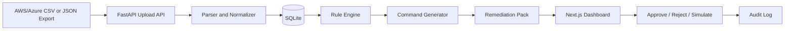

# CloudWaste Sentinel

CloudWaste Sentinel is a local, API-first FinOps remediation demo. It ingests AWS and Azure CSV/JSON exports, normalizes cloud resources into SQLite, applies deterministic waste rules, and generates evidence-backed remediation packs with human approval before any simulated action.

No real cloud APIs are called. No cloud credentials are required. No remediation command is executed.

## Architecture



## Local Setup

```bash
make backend-install
make frontend-install
```

Run the backend:

```bash
make api
```

If port `8000` is already occupied, run:

```bash
cd backend && PYTHONPATH=. uvicorn app.main:app --reload --host 127.0.0.1 --port 8001
```

Run the dashboard in another terminal:

```bash
make frontend
```

For the fallback backend port:

```bash
cd frontend && NEXT_PUBLIC_API_BASE_URL=http://localhost:8001 npm run dev
```

Open `http://localhost:3000`. API docs are available at `http://localhost:8000/docs`, or `http://localhost:8001/docs` when using the fallback backend port.

## Docker

Run the API and dashboard together:

```bash
make docker-up
```

This uses `backend/Dockerfile`, `frontend/Dockerfile`, and `docker-compose.yml`. Deployment notes for ECS and Google Cloud Run are in `DEPLOYMENT.md`.

## Demo Data

Upload these files from the dashboard:

- `backend/sample_data/aws_resources.csv`
- `backend/sample_data/azure_resources.csv`

Optional parser coverage fixtures:

- `backend/sample_data/aws_resources.json`
- `backend/sample_data/azure_resources.json`

Expected demo outcome: strong AWS/Azure unattached disk findings, idle VM candidates, protected-resource manual review, missing-metrics warnings, and provider-specific remediation commands.

## API Endpoints

- `GET /health`
- `POST /api/imports/upload`
- `GET /api/imports`
- `GET /api/resources`
- `POST /api/recommendations/run`
- `GET /api/recommendations`
- `GET /api/recommendations/{id}`
- `GET /api/recommendations/{id}/remediation-pack`
- `POST /api/recommendations/{id}/approve`
- `POST /api/recommendations/{id}/reject`
- `POST /api/recommendations/{id}/simulate`
- `GET /api/summary`
- `GET /api/export/recommendations.csv`
- `GET /api/audit-events`

## Detection Rules

- AWS unattached EBS volume: `available`/`unattached` or no attachment, positive monthly cost, no protected tag.
- Azure unattached managed disk: `Unattached` or no `managed_by`, positive monthly cost, no protected tag.
- AWS idle EC2 candidate: CPU p95 below 5 and network in/out below 100 MB.
- Azure idle VM candidate: CPU p95 below 5 and network in/out below 100 MB.
- Missing utilization metrics: flagged as `NEEDS_METRICS` with low confidence and zero claimed savings.
- Protected tags: `keep=true`, `protected=true`, `do-not-delete=true`, `environment=prod`, `owner=critical`, or `business-critical=true` trigger manual review.

## Safety Guardrails

- Generated commands are never executed.
- Simulation only records what would have been run.
- Disk deletion recommendations include snapshot commands.
- Idle VM recommendations prefer stop/deallocate or rightsizing review.
- Every finding cites source file, source row, fields, confidence, and risk.
- Approval is required before simulation.

## Tests And Eval

```bash
make test
make eval
```

The eval script compares expected sample findings against actual findings and reports missing/extra findings, command-generation status, and total estimated savings.

Verification performed during implementation:

- Backend tests: `11 passed`.
- Eval: 8 expected findings, 8 actual findings, no missing or extra findings, command generation passed.
- Frontend production build: passed with Next.js `16.2.9`.
- Local smoke check: dashboard HTTP 200 on port `3000`; API health OK on fallback port `8001`.

## Production Readiness Roadmap

For a real client deployment, this MVP would evolve into scheduled ingestion from AWS CUR, Azure Cost Management, AWS Config/Resource Explorer, Azure Resource Graph, CloudWatch, and Azure Monitor. Execution would require RBAC, two-person approval for production resources, least-privilege discovery and remediation roles, Jira/ServiceNow change tickets, Slack/Teams notifications, a controlled command runner, PostgreSQL, observability, retention policies, and SOC2-aligned audit controls.

## Limitations

- Billing exports alone cannot prove VM idleness; metrics are required for stronger confidence.
- SQLite and `create_all` are used for MVP speed, not production migrations.
- The dashboard assumes a local backend at `http://localhost:8000`.
- Command templates are deterministic examples and should be reviewed against the target account before production use.

## Cleanup Statement

This MVP creates only local files and a local SQLite database. It does not create paid cloud resources, does not call AWS or Azure APIs, and does not execute destructive commands.
